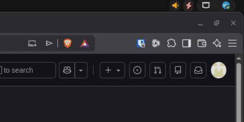
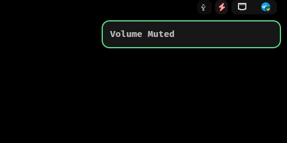
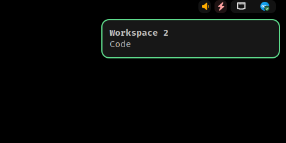
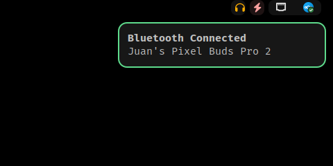

# hypr-relay

[](https://aur.archlinux.org/packages/hypr-relay)
[](LICENSE)

A lightweight daemon for Hyprland that bridges system events to your notification daemon.

Runs as a single background process and sends desktop notifications for volume, brightness, workspace, and Bluetooth changes. No keybind configuration required.



|                                |                                  |
| :----------------------------: | :------------------------------: |
|    |         |
|  |  |

## Features

| Feature    | Event source                          | Requires                    |
| ---------- | ------------------------------------- | --------------------------- |
| Volume     | `pactl subscribe`                     | `pactl`, `wpctl` (PipeWire) |
| Brightness | `udevadm monitor` (backlight)         | `brightnessctl`             |
| Workspace  | Hyprland IPC                          | nothing                     |
| Bluetooth  | `bluetoothctl` event stream           | `bluetoothctl` (BlueZ)      |

If a tool is missing, that feature is simply disabled. The rest keep working.

hypr-relay displays through whatever notification daemon you already run, and works
with any Freedesktop-compatible one: `mako`, `dunst`, `swaync`, etc.

## Installation

<details open>
<summary><strong>Arch Linux (AUR)</strong></summary>

Nice and easy, dependencies install automatically:

```bash
yay -S hypr-relay
```

[AUR package page](https://aur.archlinux.org/packages/hypr-relay)

</details>

<details>
<summary><strong>PKGBUILD (build it yourself)</strong></summary>

Builds the same pacman package straight from the repo, dependencies included:

```bash
git clone https://github.com/Vega-0b1/hypr-relay
cd hypr-relay
makepkg -si
```

</details>

<details>
<summary><strong>Dependencies</strong></summary>

Most of the tools hypr-relay uses are already on a typical Hyprland setup: `wpctl`
ships with WirePlumber (PipeWire's session manager), `pactl` comes with PipeWire's
PulseAudio compat layer, and `bluetoothctl` is part of BlueZ. You'll also need a
notification daemon such as `mako`, `dunst`, or `swaync`.

If notifications for some feature don't show up, this covers every tool hypr-relay
uses (`--needed` skips anything already installed):

```bash
sudo pacman -S --needed libpulse wireplumber brightnessctl bluez-utils
```

</details>

<details>
<summary><strong>NixOS (flake input)</strong></summary>

Add the repo as a (non-flake) input and expose it through an overlay:

```nix
# flake.nix
inputs.hypr-relay = {
  url = "github:Vega-0b1/hypr-relay";
  flake = false;
};
```

```nix
# in your NixOS configuration
nixpkgs.overlays = [
  (final: prev: { hypr-relay = prev.callPackage hypr-relay {}; })
];
environment.systemPackages = with pkgs; [
  hypr-relay
  pulseaudio    # for pactl only, PipeWire stays your sound server
  brightnessctl
];
```

`wpctl` comes from `services.pipewire` and `bluetoothctl` from
`hardware.bluetooth.enable = true`.

</details>

## Usage

Add one line to your Hyprland config:

```
exec-once = hypr-relay
```

That's the entire setup. With a default Hyprland config everything works out of the
box, and your existing keybinds keep working as-is.

### Workspace names

The second line of a workspace notification is the workspace's name. By default that
is just the workspace number. To show something more useful, give your workspaces
names with workspace rules.

Lua config (Hyprland 0.55 and newer):

```lua
hl.workspace_rule({ workspace = "1", default_name = "Main" })
hl.workspace_rule({ workspace = "2", default_name = "Code" })
```

hyprlang config (`hyprland.conf`):

```
workspace = 1, defaultName:Main
workspace = 2, defaultName:Code
```

With these rules, switching to workspace 2 shows "Workspace 2" with "Code" below it,
as in the screenshot at the top.

## How it works

hypr-relay doesn't handle keybinds. Instead it listens for the events themselves:
Hyprland's IPC socket, PipeWire sink changes, backlight udev events, and BlueZ device
events. Your keybinds keep calling `wpctl`/`brightnessctl` as normal, and notifications
appear no matter what triggered the change (keybind, hardware key, GUI, another device).

Each event source runs on its own listener thread inside one process. Notifications use
fixed IDs and the `x-canonical-private-synchronous` hint, so rapid changes (like holding
a volume key) update a single notification in place instead of stacking.

## License

MIT
